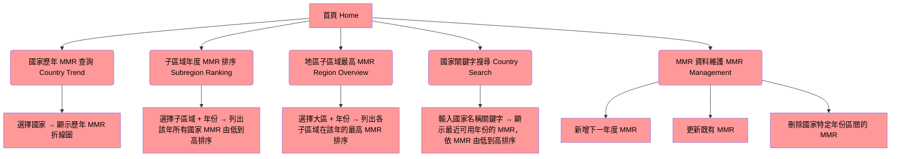
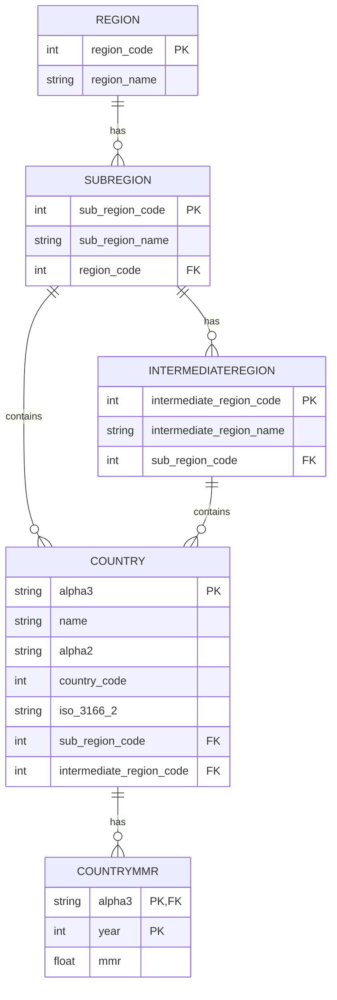

# Global MMR Visualization Website – Page Map & Data Model

## 1) Project Overview

Global MMR Visualization Website 是一個用來瀏覽與管理各國孕產婦死亡率（Maternal Mortality Ratio, MMR）的教學型網站專案。系統整合 國家地理資料 與 歷年 MMR 統計，提供互動式查詢與基本資料維護功能，協助使用者從國家、子區域（Sub-region）、大區（Region）等不同尺度觀察趨勢與差異。

系統的核心價值包含三個面向：

國家與區域資料管理**
-以 ISO 國家碼（alpha-3）為主鍵管理國家基本資料。
-以 Region / SubRegion / IntermediateRegion 的階層式結構管理地理區域。

**MMR 指標查詢與排序**
-顯示單一國家歷年 MMR 變化。
-依子區域或地區，在特定年份排序各國 MMR，找出高風險與低風險國家。

**MMR 資料維護（新增 / 更新 / 刪除）**
-針對指定國家與年份，新增下一年度 MMR 或修改既有 MMR。
-依國家與年份區間批次刪除 MMR 紀錄，方便清理錯誤資料。

這套系統也作為 資料庫正規化（3NF）與 ER 模型設計 的實作範例，後端資料以 MySQL 管理，前端網頁可彈性實作多種查詢介面與視覺化元件。

---

## 2) Page Map

###功能說明

-**國家歷年 MMR 查詢（Country Trend）**
透過下拉選單選取國家，查詢 CountryMMR 表，依年份排序顯示 MMR 變化。
-**子區域年度 MMR 排序（Subregion Ranking）**
選擇子區域與年份，利用 Country + SubRegion + CountryMMR 的關聯，列出該子區域所有國家當年 MMR，並依數值排序。
-地區子區域最高 MMR 概覽（Region Overview）
選擇地區（Region）與年份，聚合該地區下所有子區域，在指定年份計算各子區域內國家 MMR 的最大值，排序顯示。
-**國家關鍵字搜尋（Country Search）**
針對國家名稱做部分比對（LIKE 查詢），並為每個符合的國家抓出「最近有資料的年份」的 MMR，依 MMR 由低到高顯示。
-**MMR 資料維護（MMR Management）**
以 CountryMMR(alpha3, year) 為主鍵，實作：
新增某國家的下一年度 MMR。
更新指定國家 + 年份的 MMR。
刪除指定國家在某年份區間內的所有 MMR 紀錄。

## 4) Entity Relationship Diagram (ERD)

## 5) Table Descriptions
5.1 Region – 大區資料表
欄位
-region_code (INT, PK)：大區代碼（例如：002, 019）
-region_name (VARCHAR)：大區名稱（例如：Africa, Americas）
用途
-儲存最高層級的地理區域，用來統整底下所有子區域。
-供「依地區查詢 / 分組」的功能使用，例如：選擇某個 Region 後再展開其所有 SubRegion。

5.2 SubRegion – 子區域資料表
欄位
-sub_region_code (INT, PK)：子區域代碼
-sub_region_name (VARCHAR)：子區域名稱（例如：Eastern Asia）
-region_code (INT, FK → Region.region_code)：所屬大區代碼
用途
-將國家細分到較小的地理單位，用於：
-子區域內國家 MMR 排序
-地區 → 子區域 → 國家的階層式查詢
關聯
-一個 Region 可擁有多個 SubRegion。

5.3 IntermediateRegion – 中間區域資料表（若有）
欄位
intermediate_region_code (INT, PK)：中間區代碼
intermediate_region_name (VARCHAR)：中間區名稱
sub_region_code (INT, FK → SubRegion.sub_region_code)：所屬子區域
用途
若原始資料有額外一層區域分類（介於 SubRegion 與 Country 之間），則用此表表示。
部分國家可能沒有中間區，對應的 intermediate_region_code 可以為 NULL。
關聯
每個 IntermediateRegion 隸屬於一個 SubRegion。
一個 IntermediateRegion 可包含多個 Country。

5.4 Country – 國家基本資料表
欄位
alpha3 (CHAR(3), PK)：ISO 3166-1 alpha-3 國家碼（核心主鍵）
name (VARCHAR)：國家名稱
alpha2 (CHAR(2), UNIQUE)：ISO 3166-1 alpha-2 國家碼
country_code (INT, UNIQUE)：數字國碼
iso_3166_2 (VARCHAR)：ISO 3166-2 代碼
sub_region_code (INT, FK → SubRegion.sub_region_code)：所屬子區域
intermediate_region_code (INT, NULL, FK → IntermediateRegion.intermediate_region_code)：所屬中間區（可為 NULL）
用途
儲存所有「國家層級」的靜態資訊。
作為 CountryMMR 的外鍵來源，所有 MMR 資料都需對應到一個合法國家。
提供前端所有與國家相關的下拉選單、關鍵字搜尋與區域聚合查詢。
7.5 CountryMMR – 國家年度 MMR 資料表
欄位
alpha3 (CHAR(3), PK, FK → Country.alpha3)：國家代碼
year (INT, PK)：年份
mmr (FLOAT)：該國該年的孕產婦死亡率（每 100,000 活產）
主鍵
複合主鍵：(alpha3, year)
→ 保證同一國家同一年只有一筆 MMR 資料。
用途
儲存各國 MMR 歷年指標，是所有查詢與排序功能的核心資料來源。
支援：
國家歷年 MMR 趨勢圖
子區域 / 地區 年度 MMR 排序與聚合
新增 / 更新 / 刪除 MMR 紀錄
